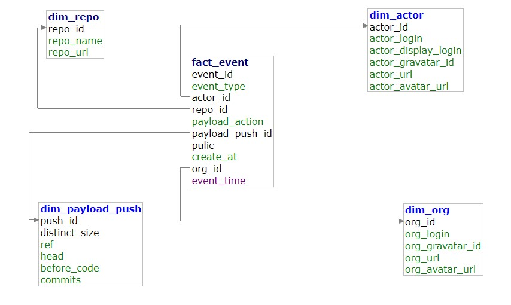

# Data Modeling I

## Getting Started in window10 via powershell
more detail python venv in window : https://mothergeo-py.readthedocs.io/en/latest/development/how-to/venv-win.html

```sh
pip install virtualenv
```
### -- you have to know location of python.exe --
```sh
cd (working_directory)
virtualenv --python C:\Path\to\python.exe (name_venv)
```
### -- for me is like --
```sh
cd C:\Users\tttt\DATA_ENGINEER\01-data-modeling-i
virtualenv --python C:\Python310\python.exe venv_data_modeling1
.\venv_data_modeling1\Scripts\activate
pip install -r requirements.txt
```

### Prerequisite when install psycopg2 package

For Debian/Ubuntu users:

```sh
sudo apt install -y libpq-dev
```

For Mac users:

```sh
brew install postgresql
```

## Running Postgres

```sh
docker-compose up
```

To shutdown, press Ctrl+C and run:

```sh
docker-compose down
```

To create table in postgres after docker compose up
check if in venv then run :

```sh
python .\create_tables.py 
```

Then To insert table in postgres 
still in venv then run :

```sh
python .\etl.py 
```

ER_DIAGRAM

