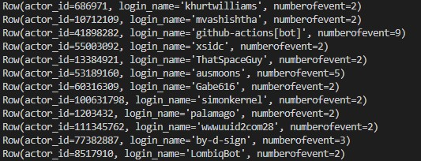

# Data Modeling II
## Data model in cassandra
| actor_id | login_name | numberofEvent |
| :---         |     :---:      |          ---: |
| 10712109   | mvashishtha     | 2    |
| 53189160     | ausmoons       | 5      |

## Getting Started 

```sh
python -m venv ENV
source ENV/bin/activate
pip install -r requirements.txt
```

## Getting Started window (with git bash via vs code)

```sh
python -m venv ENV
source ENV/Scripts/activate
pip install -r requirements.txt
```


## Running Cassandra

```sh
docker-compose up
```

To shutdown, press Ctrl+C and run:

```sh
docker-compose down
```

To create table in Cassandra after docker compose up
check if in venv then run :


```sh
python .\etl.py 
```

## Example query from cassandra keyspace

