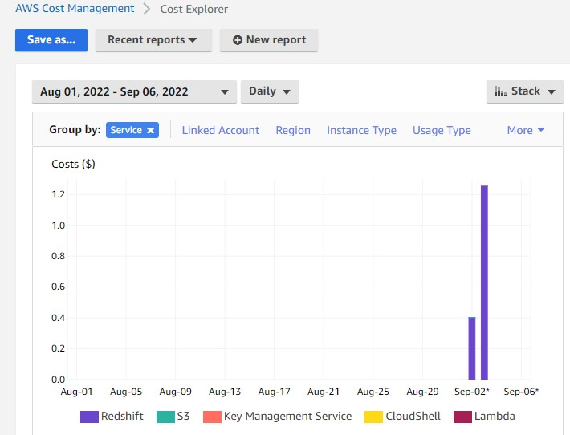

# Building a Data Warehouse

## Getting Started
### create cluster AWS Redshift
* go to aws console - Redshift 
* Provision (create) cluster

- AQUA (Advanced Query Accelerator) turn off
- Node type = ra3.xplus  - the smallest
- Number of node = 1
  - awsuser
  - set password
- click Associate IAM roles select 
   - [x] LabRole and click Associate IAM roles
- Additional configurations deselect 
   - [ ] Use defaults
- Network and security
  - Default VPC
  - VPC security groups use default
  - Cluster subnet group use Cluster subnet group-1 (it don't have create one in Configuration > subnet group , with all available zone)
  - leave the remaining default
  - create cluster

### create bucket AWS S3
* go to aws console - S3 
* create bucket
  - make sure - [x] **Block all public access** 
  - keep - [x] Disable for Bucket Versioning
  - create bucket
### upload json to bucket
* Json event file
* Json path file

### Check IAM Role for LabRole
* go IAM
* choose Role
* seach "LabRole"
* copy ARN


## create table in Redshift

```sh
CREATE TABLE IF NOT EXISTS github_event (
  event_id text primary key,
  event_type text,
  actor_login text,
  repo_name text,
  created_at text
  
)
```


## insert data from json with json_path

```sh
copy github_event
from 's3://tanabruce-bucket06092022/github_events_01.json'
iam_role 'arn:aws:iam::423544405765:role/LabRole' 
json 's3://tanabruce-bucket06092022/events_json_path.json';
```

To show data in table github_event:

```sh
select * from github_event
```
see the result in 
[github_event_query_result.csv](github_event_query_result.csv)

To close all service
- S3 empty bucket
- Delete S3 bucket
- Delete Redshift cluster** with out keeping snapshot** - [ ] snap shot 


## watch cost explorer


