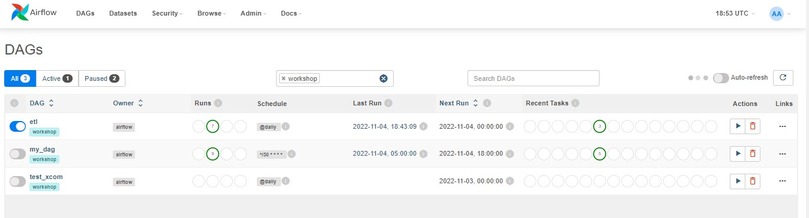
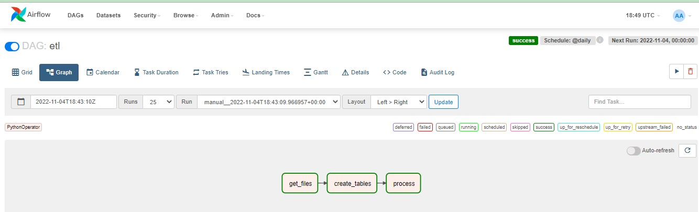
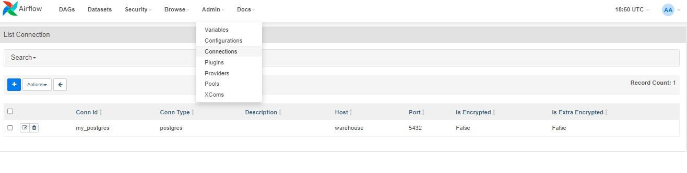
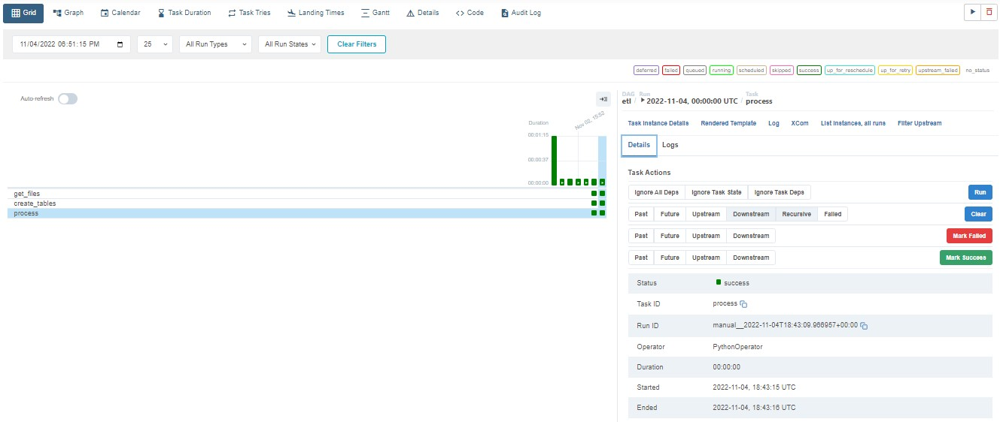
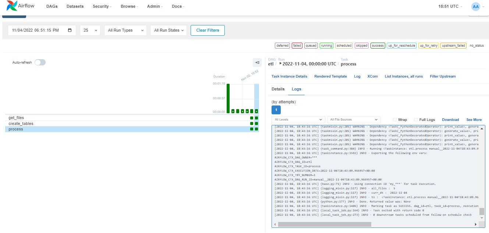
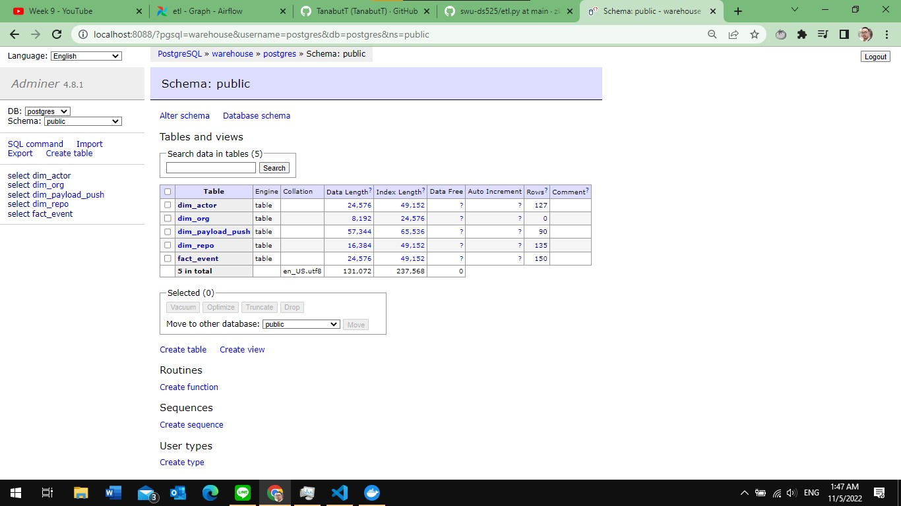
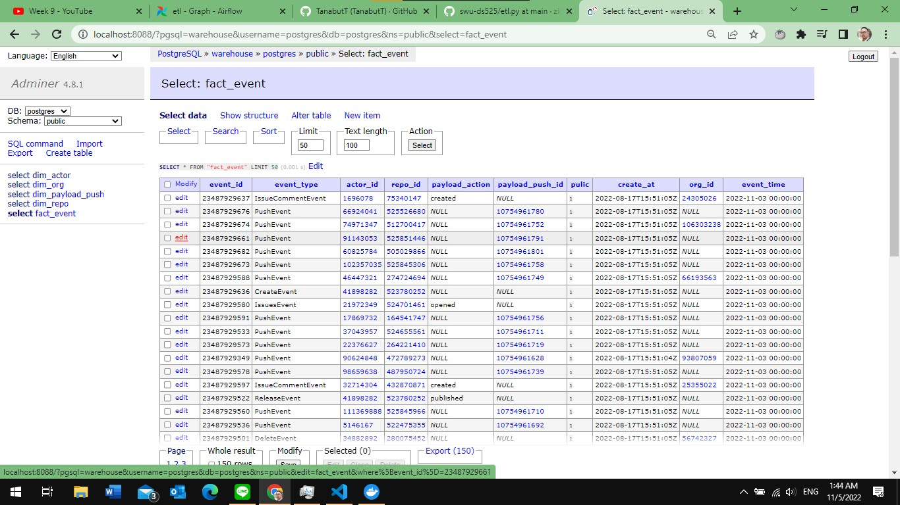
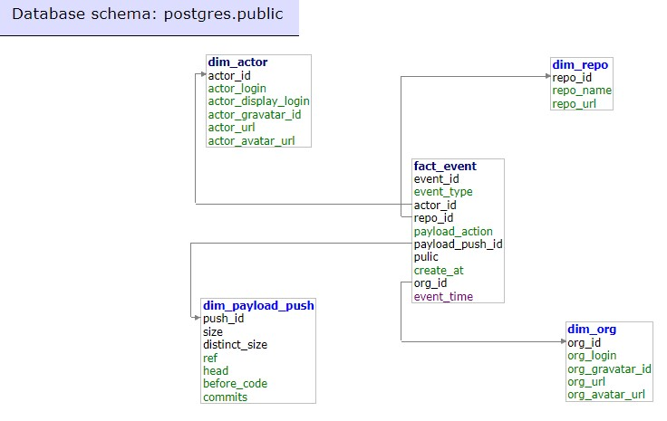
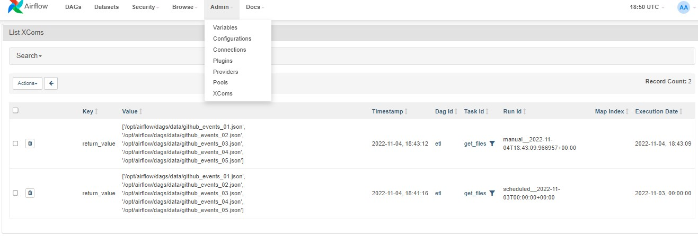

# Creating and Scheduling Data Pipelines

ถ้าใช้งานระบบที่เป็น Linux ให้เรารันคำสั่งด้านล่างนี้ก่อน

```sh
mkdir -p ./dags ./logs ./plugins
echo -e "AIRFLOW_UID=$(id -u)" > .env
```

หลังจากนั้นให้รัน

```sh
docker-compose up -d
```
option -d คือการทำให้ terminal run docker container และยังกลับมาใช้ terminal หน้านั้นได้อีก เก็บ process container ไว้ที่ background  

เสร็จแล้วให้คัดลอกโฟลเดอร์ `data` ที่เตรียมไว้ข้างนอกสุด เข้ามาใส่ในโฟลเดอร์ `dags` เพื่อที่ Airflow จะได้เห็นไฟล์ข้อมูลเหล่านี้ แล้วจึงค่อยทำโปรเจคต่อ

**หมายเหตุ:** จริง ๆ แล้วเราสามารถเอาโฟลเดอร์ `data` ไว้ที่ไหนก็ได้ที่ Airflow ที่เรารันเข้าถึงได้ แต่เพื่อความง่ายสำหรับโปรเจคนี้ เราจะนำเอาโฟลเดอร์ `data` ไว้ในโฟลเดอร์ `dags` เลย


## Service port from container 
- open with browser go to http:/localhost:<port_number>
- Airflow UI -> port 8080  
- postgres database -> port 8088  

การ connection postgres database ให้ดูจากไฟล์ docker-compose.yaml (server ใช้ชื่อเดียวกับ service docker คือ "warehouse"


## problems along the process and how to solve them
เจอปัญหา ใน window 10 คือ เมื่อ run docker container เครื่องของเรา cpu and memory จะโดนใช้งานผ่าน virtual machine จากการใช้ WSL ของ docker เอง
แก้ด้วยการ ไป config ใน setting ของ docker > Resources > Advanced
- You can configure limits on the memory, CPU, and swap size allocated to WSL 2 in a .wslconfig file.
 - https://learn.microsoft.com/en-us/windows/wsl/wsl-config#configure-global-options-with-wslconfig or  
 - https://www.makeuseof.com/vmmem-process-high-resource-consumption/  

ในที่นี้ทำการ limit WSL memory=2GB ทำให้เครื่องไม่หน่วงมากเกินไป

## DAG code
ดูได้ที่ ไฟล์ [/dag/etl.py](https://github.com/TanabutT/swu_DS525_DE/blob/main/05-creating-and-scheduling-data-pipelines/dags/etl.py)  

แยก ไฟล์ sql command ไว้ใน [/dags/sql_queries.py](/dags/sql_queries.py)

## Pic after run docker container and run Airflow pipeline  

- DAG list (show only tag: workshop)  
 
 

- DAG graph show the pipeline data flow  

  
 
- Admin in airflow keep credential secure for connection to postgres database  
 


- grid detail and log in airflow tool  
 


  

- Insert to postgres database  
 
  
  

- database schema in postgres database  
 
  

- test xcom use case to send small data through pipeline  
 



